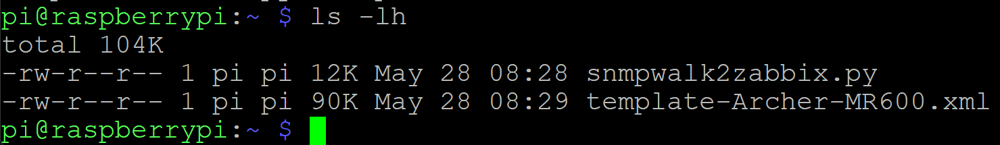
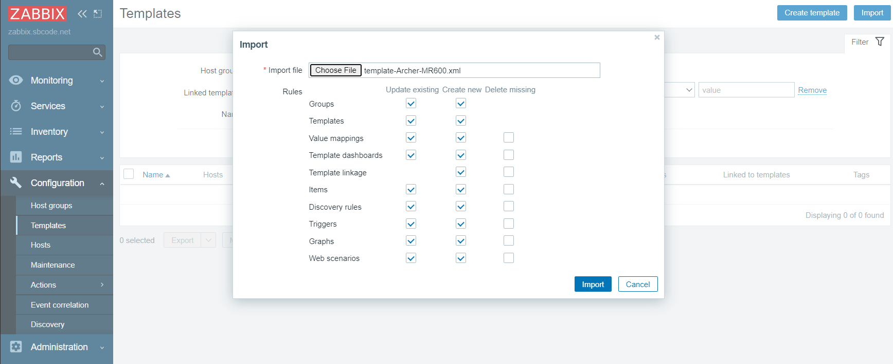
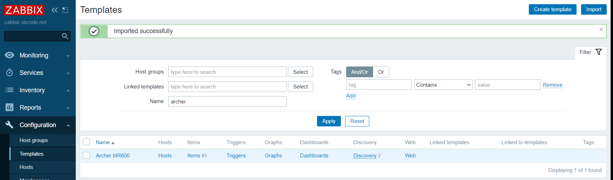
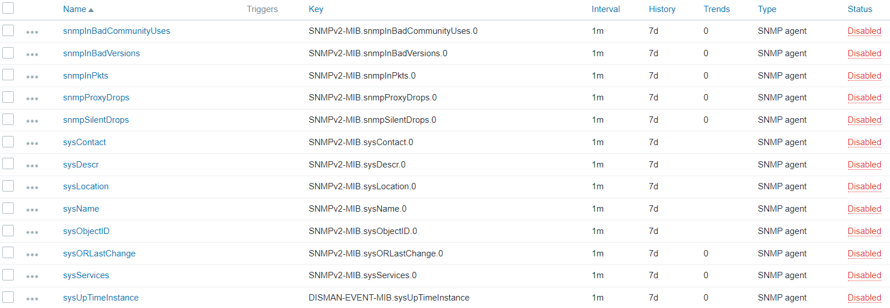
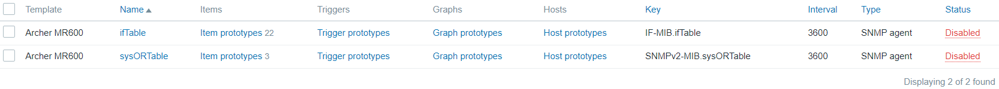

# SNMPWALK2ZABBIX

Create a Zabbix template from an SNMPWALK response.

**NOTE** that this will **NOT** create a fully featured all bells and whistles perfect template exactly for your needs. You will need to edit the result to make it exactly whatever you want it to be.

Remember, you got it for free, and it comes with no support or warranty. Read the [license](LICENSE).

## Download

```bash
wget https://raw.githubusercontent.com/Sean-Bradley/SNMPWALK2ZABBIX/master/snmpwalk2zabbix.py
```

## Requirements

- Linux (Tested on Debian GNU/Linux 11 (bullseye)),
- Python3 (use `python3 -V` to check)
- SNMP (uses SNMPv2 to query)
- SNMP-MIBS-Downloader
- Any other custom or proprietary MIBs you may want to use while it tries to generate the item and discovery rule names and descriptions.

To install SNMP and snmp-mibs-downloader on Debian/Ubuntu,

```bash
sudo apt update
sudo apt install snmp snmp-mibs-downloader
```

## Usage

```bash
python3 snmpwalk2zabbix.py community-string IP-address root-OID
```

- `community-string` : This is the v2c community name. Most systems default to use `public` as the community name.
- `IP-address` : The IP address of the SNMP device that returns a valid `snmpwalk` response.
- `root-OID` : Indicates which OID to start creating items from. An OID very low, e.g, `1`, will result in a much larger template, versus `1.3` or `1.3.6` or `1.3.6.1` or `1.3.6.1.2`, etc.

## Example

Before using, ensure that you can at least do a simple `snmpwalk` from the server that you are running this script from.

E.g., I can `snmpwalk` my network router, and it responds.

```bash
snmpwalk -v 2c -c public 192.168.1.1 1.3.6.1.2.1
```

Example output

```
SNMPv2-MIB::sysDescr.0 = STRING: 1.2.0 0.9.1 v0001.0 Build 201203 Rel.59032n
SNMPv2-MIB::sysObjectID.0 = OID: SNMPv2-SMI::enterprises.16972
DISMAN-EVENT-MIB::sysUpTimeInstance = Timeticks: (292015000) 33 days, 19:09:10.00
SNMPv2-MIB::sysContact.0 = STRING: unknown
SNMPv2-MIB::sysName.0 = STRING: Archer MR600
SNMPv2-MIB::sysLocation.0 = STRING: unknown
... and many more lines
```

Now to generate the template.

```bash
python3 snmpwalk2zabbix.py public 192.168.1.1 1.3.6.1.2.1
```

It will try to produce a Zabbix 6 LTS compatible XML template that you can import.

E.g.,

```xml
<?xml version="1.0" encoding="UTF-8"?>
<zabbix_export>
    <version>6.0</version>
    <templates>
        <template>
            <uuid>612e6942006545ad90f9962eb1ccce14</uuid>
            <template>Archer MR600</template>
            <name>Archer MR600</name>
            <description>Template built by SNMPWALK2ZABBIX script from https://github.com/Sean-Bradley/SNMPWALK2ZABBIX</description>
            <groups>
                <group>
                    <name>Templates</name>
                </group>
            </groups>
            <items>
                <item>
                    <uuid>5d438a37f38f484fa387a6eb455113fd</uuid>
                    <name>sysDescr</name>
                    <type>SNMP_AGENT</type>
                    <snmp_oid>.1.3.6.1.2.1.1.1.0</snmp_oid>
                    <key>SNMPv2-MIB.sysDescr.0</key>
                    <value_type>CHAR</value_type>
                    <description>A textual description of the entity. This value should include the full name and version identification of the system's hardware type, software operating-system, and networking software.</description>
                    <history>7d</history>
                    <trends>0</trends>
                    <status>DISABLED</status>
                </item>
                ... and many more XML nodes
```

The XML file will be saved into the same folder as where the script was run. It named my example output file as `template-Archer-MR600.xml`



Copy the saved XML file to a location on your computer where you can then import it into the Zabbix templates configuration using the UI.



My example template for my Archer MR600 router was created with 81 items, and 2 discovery rules.



Here are some of the items it found.



Here are the discovery rules that it created with their item prototypes.



Note that the generated template is not perfect. It is up to me if I want to make it better. The items and discovery rules are created as **DISABLED** by default. This is to minimize the possibility that assigning this template to a host won't overload your Zabbix server/proxy or your SNMP host/device.

Automatically creating templates is NOT an exact science. Who knows what the output will be. If it was easy, someone would have already written the perfect solution for you.

After importing the template, you should review which items and discovery rules that you want enabled. If a MIB description can be found for an OID, then it will use it in the name and description of the item and discovery rule. And hopefully that will make the process of decided if you want it enabled or not, a little easier.

When you assign your new template to a host in Zabbix. Make sure that your Zabbix server, or Zabbix proxy (if monitored by proxy) can also access your SNMP host/device. I have many Zabbix and SNMP tutorials at https://sbcode.net/zabbix/setup-snmp-host/.

Also note that despite the creation of the template requiring SNMPv2, you can actually still use the resulting template with a SNMPv3 configured host provided that you've configured your host correctly in Zabbix to use SNMPv3. I have some documentation about using SNMPv3 in Zabbix at https://sbcode.net/zabbix/snmpv3-host/

I say again. This script will NOT automatically create a fully featured all bells and whistles perfect template exactly for all your needs. The resulting template may be very large and contain many useless items and discovery rules. You will need to edit the result to make it exactly whatever you want it to be.

Remember, you got it for free, and it comes with no support or warranty. Read the [license](LICENSE).

If you are interested in learning Zabbix to a high level, then I run courses on it. Visit https://sbcode.net/zabbix/ for more information and discount coupons.

Sean
